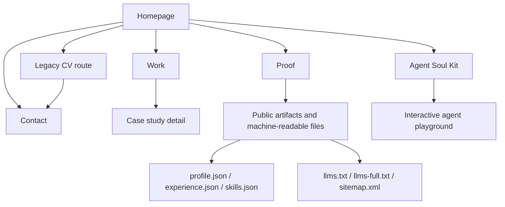

# tonianev.github.io

[](https://tonianev.com)
[](./site.css)
[](./llms.txt)
[](./profile.json)

Personal website for Toni Anev: ML platform engineering leadership, selected case studies, and contact-driven hiring conversations.

## Site map



## Live Site

- https://tonianev.com

## Goals

- Clear positioning for recruiters, hiring managers, and technical peers.
- Human-readable content with machine-friendly metadata and structured data.
- Search and crawler friendliness across traditional bots and LLM systems.
- Resume access routed through direct contact instead of a public file drop.

## Stack

- Static HTML/CSS/JS
- No runtime framework or build step required

## Site Structure

- `index.html` - homepage and positioning
- `about.html` - background, approach, and stack
- `work.html` - case studies and outcomes
- `proof.html` - public proof artifacts and machine-readable references
- `agent-soul-kit.html` - agent soul kit concept and interactive demo
- `CV.html` - legacy resume URL converted into a resume-request landing page
- `contact.html` - contact entry points
- `site.css` - shared styling
- `site.js` - interaction behavior
- `agent-soul-kit/` - standalone scaffold for a portable soul/memory/posture repository
- `profile.json` - machine-readable profile summary
- `experience.json` - machine-readable role highlights
- `skills.json` - machine-readable skills taxonomy
- `artifacts/ml-platform-rfc-template.md` - architecture decision template
- `artifacts/ml-incident-runbook-template.md` - incident response template
- `artifacts/ml-production-readiness-scorecard.md` - launch readiness scoring template
- `artifacts/agent-soul-kit-blueprint.md` - public repository design for portable agent soul/memory files

## Machine Readability

- `robots.txt` - crawler policy
- `sitemap.xml` - canonical URL index
- `llms.txt` - concise AI/LLM guidance
- `llms-full.txt` - expanded AI/LLM context
- `humans.txt` - human authorship and stack metadata
- `.well-known/security.txt` - responsible disclosure contact
- `site.webmanifest` - installable web app metadata
- JSON-LD schema in page `<head>` sections

## Local Development

From repository root:

```bash
python3 -m http.server 8080
```

Then open [http://localhost:8080](http://localhost:8080).

## Quality Checks

```bash
npx --yes htmlhint@latest "./*.html"
```

```bash
node --check site.js
```

```bash
git status --short
```

## Deployment

This repository is published via GitHub Pages with `CNAME` configured for `tonianev.com`.
