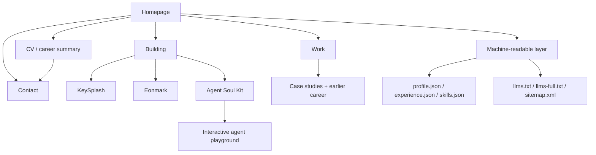

# tonianev.github.io

[](https://tonianev.com)
[](./site.css)
[](./llms.txt)
[](./profile.json)

Personal website for Toni Anev: AI platform engineering leadership, selected case studies, and a direct line for conversations.

## Design

Glass: a dark-first navy palette with a light theme that follows `prefers-color-scheme`, a frosted pill header and nav, translucent rounded cards, and one blue accent. Set in Manrope and IBM Plex Mono, with scroll reveals and count-up figures that respect reduced-motion settings.

## Site map


```mermaid
flowchart TD
    A["Homepage"] --> B["Work"]
    A --> C["CV / career summary"]
    A --> D["Contact"]
    A --> K["Building"]
    K --> L["KeySplash"]
    K --> M["Eonmark"]
    K --> E["Agent Soul Kit"]
    B --> F["Case studies + earlier career"]
    C --> D
    A --> G["Machine-readable layer"]
    G --> H["profile.json / experience.json / skills.json"]
    G --> I["llms.txt / llms-full.txt / sitemap.xml"]
    E --> J["Interactive agent playground"]
```

## Live Site

- https://tonianev.com

## Goals

- Clear positioning for technical peers and collaborators.
- Human-readable content with machine-friendly metadata and structured data.
- Search and crawler friendliness across traditional bots and LLM systems.
- CV.html carries the public career summary; the full resume is not published.

## Stack

- Static HTML/CSS/JS
- No runtime framework or build step

## Site Structure

- `index.html` - homepage: hero, about, selected work, building, contact
- `work.html` - case studies (Sanofi, Petco, Loblaw), earlier career, education
- `CV.html` - public career summary
- `agent-soul-kit.html` - agent soul kit concept and interactive playground
- `about.html` / `contact.html` / `proof.html` - meta-refresh redirects to homepage anchors
- `site.css` - the glass design system (tokens, components, dark and light themes)
- `site.js` - theme sync, mobile nav, scroll reveals, count-up figures, playground logic
- `agent-soul-kit/` - standalone scaffold for a portable soul/memory/posture repository
- `profile.json` / `experience.json` / `skills.json` - machine-readable career data
- `artifacts/` - ML platform templates (RFC, runbook, readiness scorecards, principles)

## Machine Readability

- `robots.txt` - crawler policy
- `sitemap.xml` - canonical URL index
- `llms.txt` / `llms-full.txt` - AI/LLM guidance and expanded context
- `humans.txt` - human authorship and stack metadata
- `.well-known/security.txt` - responsible disclosure contact
- `site.webmanifest` - installable web app metadata
- JSON-LD schema in page `<head>` sections

## Local Development

From repository root:

```bash
python3 -m http.server 8080
```

Then open [http://localhost:8080](http://localhost:8080).

## Quality Checks

```bash
npx --yes htmlhint@latest "./*.html"
node --check site.js
```

CI (`.github/workflows/site-quality.yml`) runs htmlhint, a JS syntax check, and a lychee link check on every push and pull request.

## Deployment

This repository is published via GitHub Pages with `CNAME` configured for `tonianev.com`.
